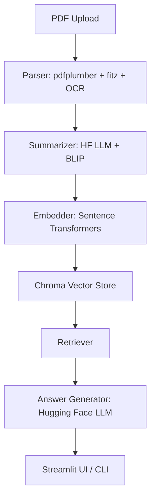

# 📄 Multimodal RAG — Windows Ready (Hugging Face Powered)

A **production-grade Retrieval-Augmented Generation (RAG) system** that ingests PDFs (text, tables, images), summarizes and embeds them into a **Chroma vector database**, and enables **multimodal question answering** via Hugging Face models.  

Built with **Windows compatibility in mind**, it works seamlessly with PDFs containing **text, tables, and images**, and offers both a **Streamlit UI** and **CLI scripts** for interaction.

---
## 🎥 Demo Video

[](https://www.youtube.com/watch?v=abcd1234)


## ✨ Key Highlights

- 🔍 **Document parsing**: Extracts text, tables, and images from PDFs (with robust fallbacks).
- 📝 **Summarization**: Generates concise bullet-point summaries for each text/table block.
- 🖼 **Image understanding**: Supports image captioning with Hugging Face BLIP or OCR fallback.
- 🧠 **Embeddings**: Uses **Sentence Transformers** (Hugging Face) for vectorization.
- 📦 **Vector store**: Stores embeddings in a persistent **ChromaDB** instance.
- ❓ **RAG Retrieval**: Semantic search across multimodal docs with metadata tracking.
- 💬 **Answer generation**: Context-aware answers using Hugging Face LLMs.
- 🎛 **UI + CLI**: Query via a **Streamlit web app** or simple command-line interface.
- 🖥 **Windows-first**: Includes instructions for Poppler, Tesseract, and Visual C++ build tools.

---

## 🏗 Architecture




⚙️ Tech Stack

Language: Python 3.10+

LLMs / Embeddings: Hugging Face (transformers, sentence-transformers)

Vector Database: ChromaDB

PDF Parsing: pdfplumber, PyMuPDF (fitz), optional unstructured

Image Captioning: Hugging Face BLIP, fallback: Tesseract OCR

Frontend: Streamlit

Environment: .env with API/model settings

### 📂 Project Structure
```
multimodal-rag/
├─ .env.example
├─ requirements.txt
├─ README.md
├─ data/
│  ├─ docs/            # PDFs + extracted assets
│  └─ chroma_db/       # Persistent Chroma storage
├─ pipeline/
│  ├─ pdf_parser.py    # Text, table, image extraction
│  ├─ summarizer.py    # Text + image summarization
│  ├─ embedder.py      # Sentence-transformers embeddings
│  ├─ vectorstore.py   # ChromaDB wrapper
│  ├─ retriever.py     # Semantic retrieval
│  ├─ multimodal_llm.py# Answer generator
│  └─ pipeline.py      # End-to-end coordinator
├─ app/
│  └─ streamlit_app.py # UI
├─ scripts/
│  ├─ index_pdf.py     # CLI for indexing
│  └─ query_console.py # CLI for querying
└─ utils/
   ├─ io_utils.py
   └─ constants.py

```
### Quick Start (Windows)
1. Setup Environment
   ```
    git clone https://github.com/<your-username>/multimodal-rag.git
    cd multimodal-rag
    python -m venv .venv
    .venv\Scripts\activate
    pip install -r requirements.txt
   ```
2. Install External Tools (Windows)

  Poppler → Download
   → add /bin to PATH
  
  Tesseract OCR (optional, for OCR) → Download
  
3. Configure .env
   ```
   cp .env.example .env
    ```
4. Index a PDF
   ```
    python scripts/index_pdf.py ./data/docs/sample.pdf
   ```
6. Query from CLI
```python scripts/query_console.py```


8. Run the Streamlit UI
```streamlit run app/streamlit_app.py --server.port 8501```

### 📊 Example Workflow

Upload a research paper PDF.

Pipeline:

Extracts text, tables, and images.

Summarizes text and captions images.

Embeds content with Sentence Transformers.

Stores vectors + metadata in ChromaDB.

Ask: “Summarize table results from page 3 and explain figure 2.”

System:

Retrieves relevant summaries + captions.

Generates a concise multimodal answer using Hugging Face LLM.

### 🚀 Why This Project Matters

✅ Demonstrates end-to-end RAG with multimodal support.

✅ Windows-first setup shows real-world deployability.

✅ Uses open-source Hugging Face models (cost-efficient, privacy-friendly).

✅ Clean modular structure for scalability and extension.

✅ Showcases both backend engineering (pipelines, vector DBs) and frontend integration (Streamlit).

### 🔮 Next Steps

Dockerize for cross-platform reproducibility.

Integrate lightweight PEFT/LoRA fine-tuning for domain-specific adaptation.

Add evaluation metrics (retrieval recall, answer faithfulness).

Support hybrid retrieval (sparse + dense).

Extend UI with file history and visualization of embeddings.

### 👨‍💻 Author

Built with ❤️ by Anandhu p

💼 AI/ML Engineer | Data Science Enthusiast

🌐 Portfolio: [https://github.com/Anandhu-p-tec]

📧 Contact: [anandhupadmanabhank@gmail.com]
   

  


